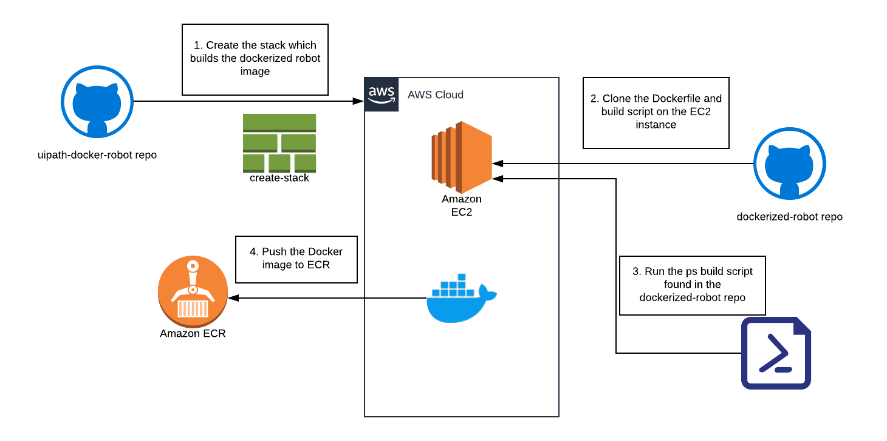

# Dockerized robot build CFN template

CFN template used to build an UiPath robot in a Docker container


## Prerequisites

* AWS account with appropriate Role
* A Key pair for accessing the provisioned instance is needed

## Purpose

The stack described in the CFN template provisions the necessary infrastructure to build a `Docker` image containing the UiPath robot and PowerShell module needed to communicate with Orchestrator

For this, an EC2 instance is launched and during its launch script, the [dockerized-robot repository](https://github.com/AndreiBarbuOz/dockerized-robot) is downloaded and the script is run

## Deployment

To build the docker image, just create the stack from command line:

```cmd
aws cloudformation create-stack --stack-name docker-build --template-body file://docker-build.yaml --parameters file://docker-build-params.json --capabilities CAPABILITY_IAM
```


